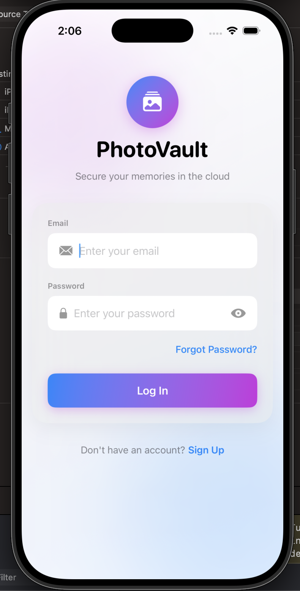
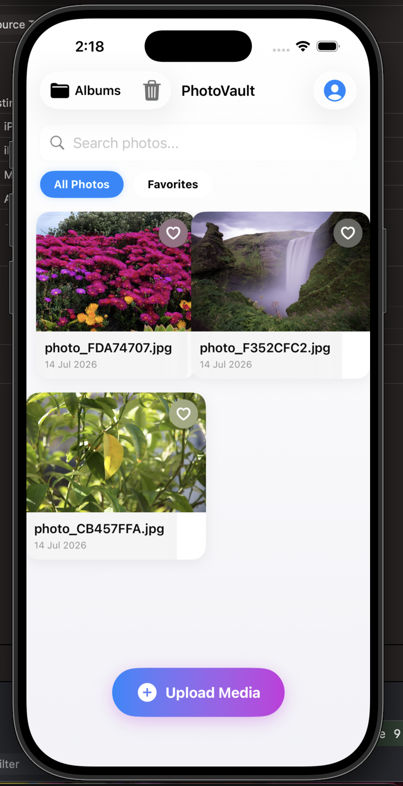
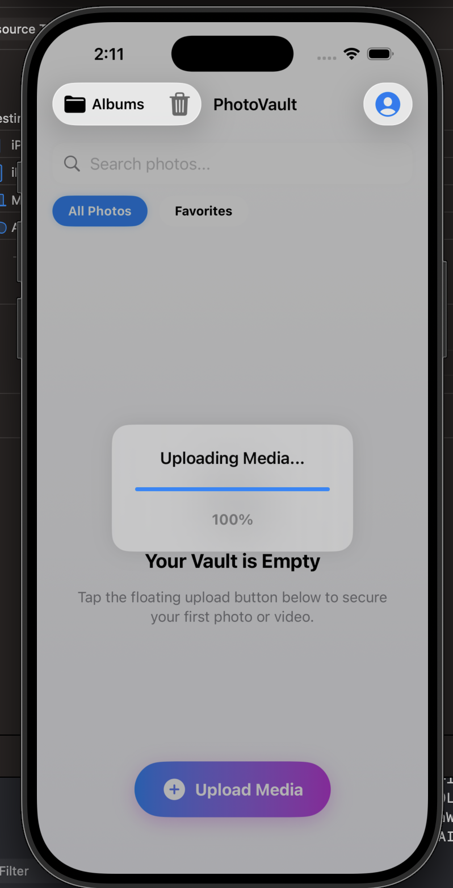
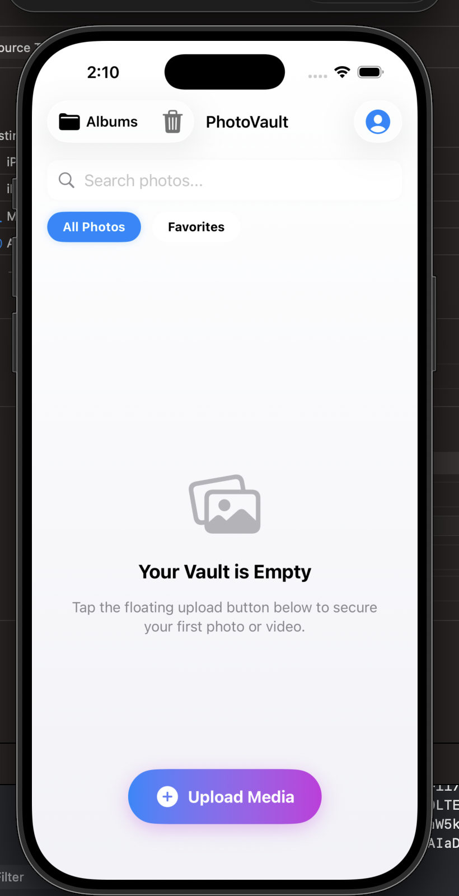
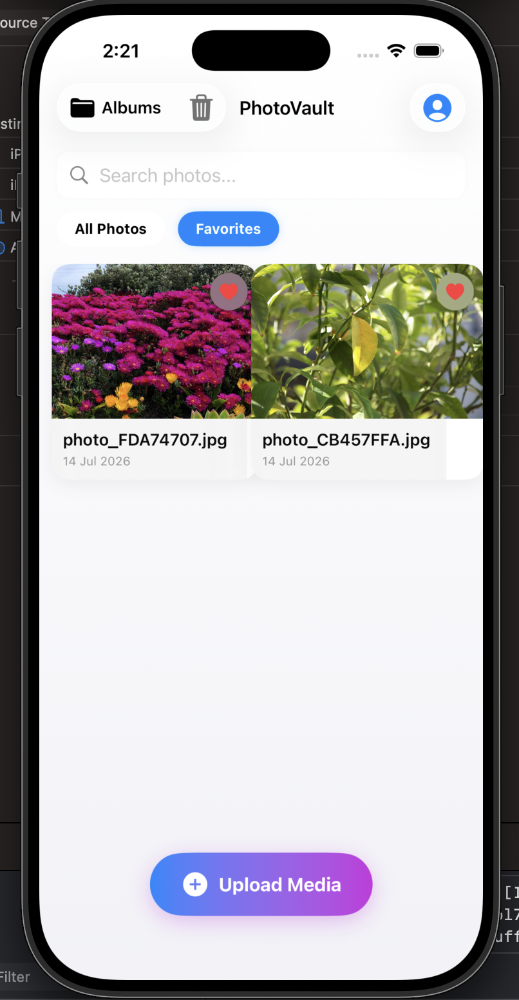
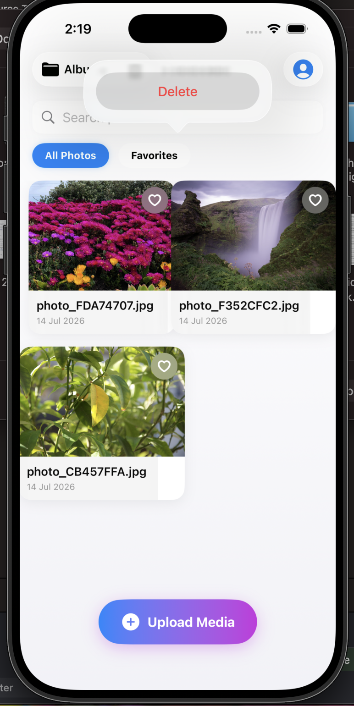
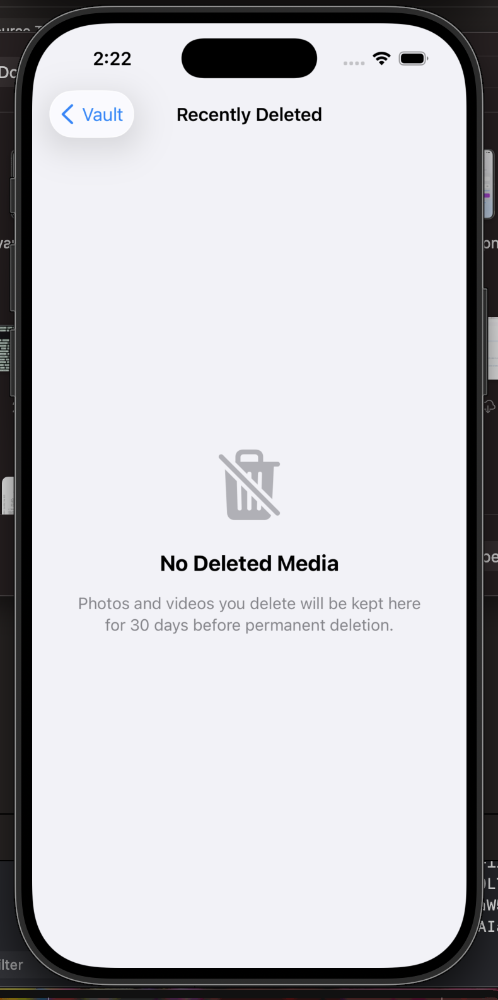
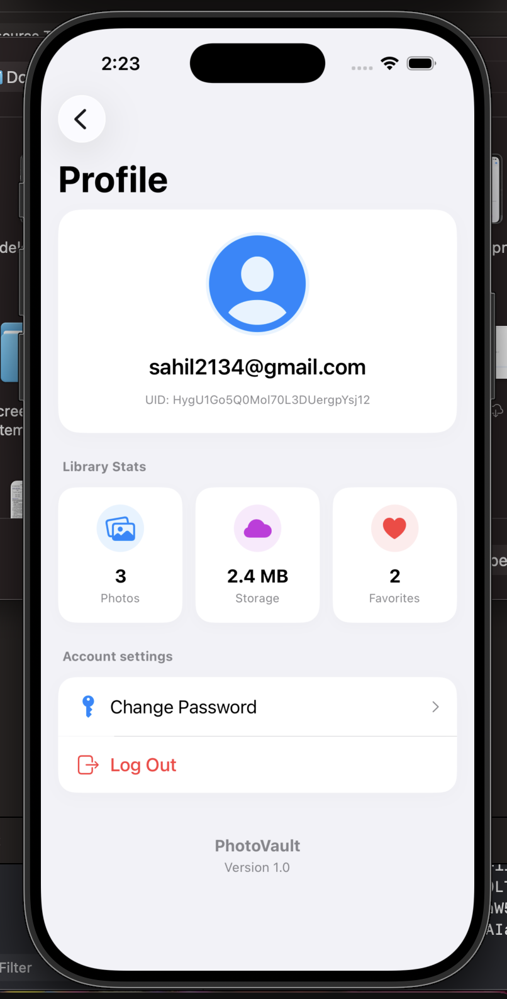

# 📸 PhotoVault

A secure cloud-based **iOS Photo Vault** application built with **SwiftUI**, **Firebase Authentication**, **Cloud Firestore**, and **ImageKit**. PhotoVault enables users to securely upload, organize, search, favorite, restore, and manage their private photos through a clean, modern, and intuitive user interface.


---

## ✨ Features

### 🔐 Authentication
- Secure User Registration
- User Login
- Password Reset
- Logout

### ☁️ Cloud Storage
- Secure Image Upload using ImageKit
- Cloud Firestore Database Integration

### 📸 Photo Management
- Upload Photos
- View Personal Gallery
- Search Photos
- Mark Photos as Favorites
- Swipe to Delete
- Recently Deleted Folder
- Restore Deleted Photos

### 📱 User Experience
- Pull to Refresh
- Modern SwiftUI Interface
- Responsive UI
- Profile Screen
- Storage Statistics

---

## 🛠️ Tech Stack

- Swift
- SwiftUI
- Firebase Authentication
- Cloud Firestore
- ImageKit
- MVVM Architecture
- Async/Await
- Xcode

---

## 🏗️ Architecture

The project follows the **MVVM (Model-View-ViewModel)** architecture to ensure clean code, modularity, scalability, and maintainability.

```
PhotoVault
│
├── Models
├── Managers
├── Utilities
├── ViewModels
├── Views
├── Assets.xcassets
└── Resources
```

---

# 📱 Screenshots

| Login | Empty Vault |
|:------:|:-----------:|
|  |  |

| Upload | Home |
|:------:|:----:|
|  |  |

| Favorites | Delete |
|:---------:|:------:|
|  |  |

| Recently Deleted | Profile |
|:----------------:|:-------:|
|  |  |

---

## 🚀 Getting Started

### Clone the Repository

```bash
git clone https://github.com/Veer666/PhotoVault.git
```

### Open the Project

```bash
cd PhotoVault
open PhotoVault.xcodeproj
```

### Configure Firebase

1. Create a Firebase Project.
2. Enable **Authentication**.
3. Enable **Cloud Firestore**.
4. Download `GoogleService-Info.plist`.
5. Add the file to the Xcode project.
6. Configure ImageKit credentials.
7. Build and Run.

---

## 📂 Project Structure

```
PhotoVault
├── Models
├── Managers
├── Utilities
├── ViewModels
├── Views
├── Assets.xcassets
├── screenshots
└── Resources
```

---

## 🚀 Future Improvements

- 🔐 Face ID / Touch ID Authentication
- 📁 Album Management
- 🎥 Video Support
- 🔒 End-to-End Encryption
- 🤝 Shared Albums
- 🌙 Dark Mode
- 📶 Offline Caching
- ☁️ iCloud Backup Support

---

## 🤝 Contributing

Contributions are welcome!

1. Fork the repository
2. Create a feature branch
3. Commit your changes
4. Push your branch
5. Open a Pull Request

---

## 📄 License

This project is licensed under the **MIT License**.

---

## 👨‍💻 Developer

**Vir Daksh Kumar**

🎓 B.Tech Computer Science & Engineering  
National Institute of Technology Hamirpur

💻 iOS Developer  
📱 Swift & SwiftUI Enthusiast  
🚀 Passionate about building clean, scalable, and user-friendly mobile applications.

### Connect with me

- GitHub: https://github.com/Veer666

---

⭐ **If you found this project helpful, please consider giving it a Star!**
